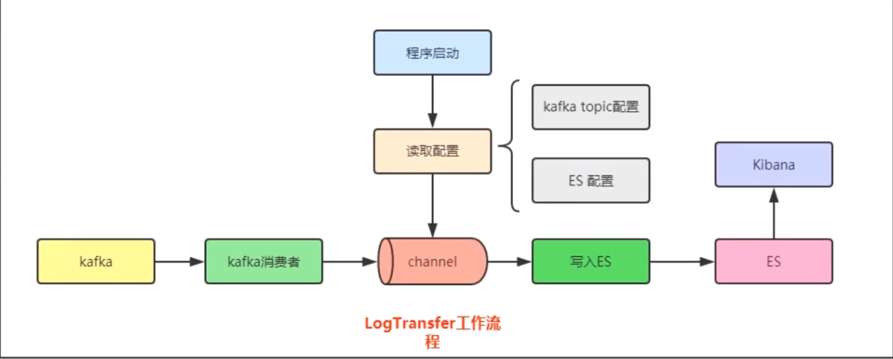

# logtranfers
### 一、项目架构图


### 二、环境搭建
    1. 提前下载并安装好 elasticsearch
    2. 提前下载并安装好 kafka
    3. 提前下载并安装好 kibana
   
### 三、启动
##### 1. 启动kafka
``` bash
    启动kafka: kafka-server-start.bat ..\..\config\server.properties
    创建主题: .\bin\windows\kafka-topics.bat --create --zookeeper localhost:2181 --replication-factor 1 --partitions 1 --topic test
```
##### 2. 启动elasticsearch
``` bash
    启动elasticsearch: bin\elasticsearch.bat
```
##### 3. kibana搭建
``` bash
    启动kibana: bin\kibana.bat
```
